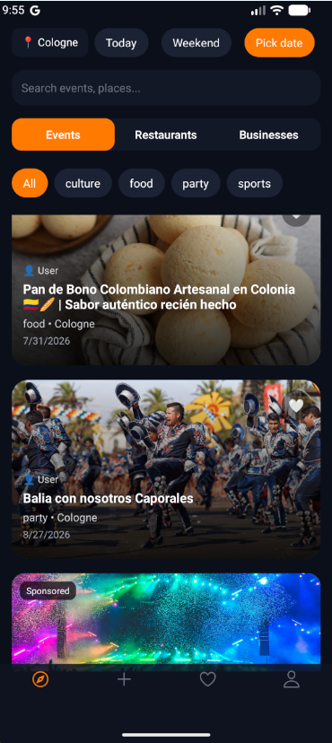
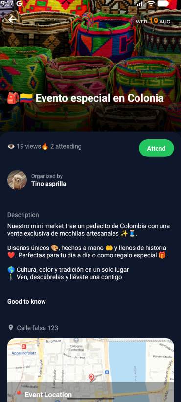
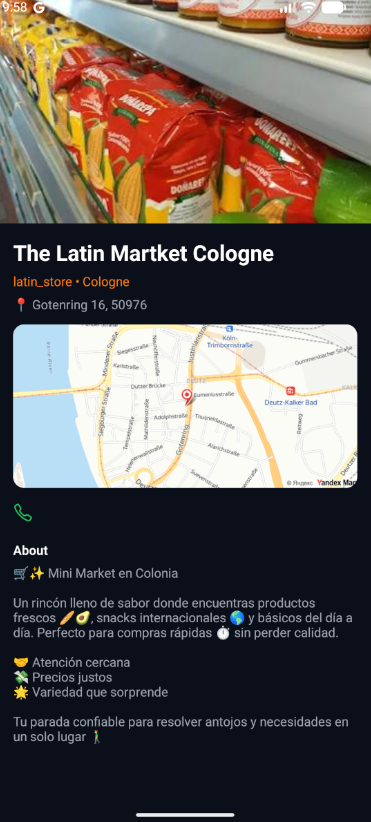
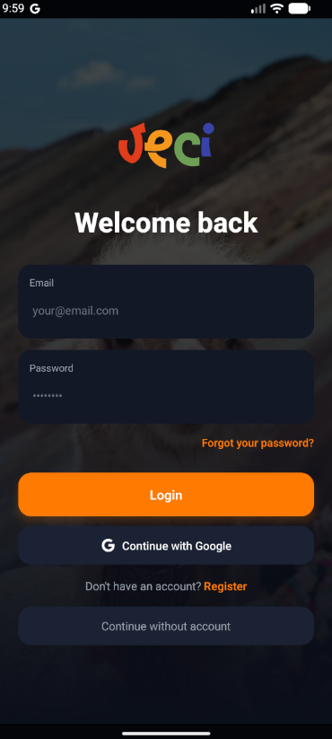
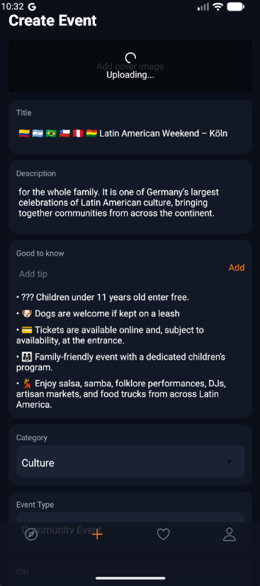
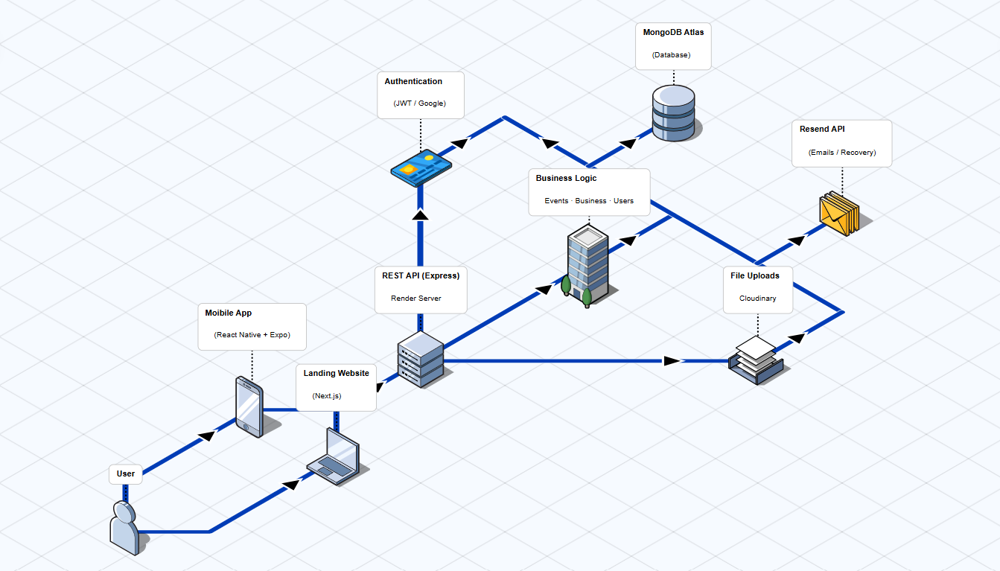

<div align="center">

# 🌎 Veci

### Connecting Latin Americans across Europe.

A mobile-first community platform that helps Latin Americans living in Europe discover local events, trusted businesses, and meaningful communities.

<p>


</p>

---

## 📱 Screenshots

> Screenshots will be added as the UI reaches production quality.

| Home | Events | Businesses |
|------|---------|------------|
|  |  |  |

| Login | Profile | Create Event |
|------|----------|--------------|
|  |  |  |

</div>

---

# Table of Contents

- About
- The Problem
- The Solution
- Vision
- Features
- Technology Stack
- Architecture
- Security
- Folder Structure
- Getting Started
- Environment Variables
- API Overview
- Roadmap
- Documentation
- Author
- License

---

# About

**Veci** is a mobile-first community platform created to help **Latin Americans living in Europe** discover local communities, cultural events, businesses, and opportunities while building meaningful relationships in their new cities.

The project originated from the research conducted during my **Master's degree in Web Science at TH Köln**, where I explored the concept of **Digital Belonging**—how technology can reduce social isolation among immigrants by strengthening community connections.

Rather than being just another social network, Veci aims to become the digital ecosystem for Latin American communities across Europe.

---

# The Problem

Moving abroad is exciting, but it can also be overwhelming.

Many Latin Americans arrive in a new country without knowing:

- Where to meet people
- Where to find authentic Latin businesses
- Which cultural events are happening nearby
- Which communities already exist
- Who to trust for local recommendations

Today, this information is scattered across:

- Facebook Groups
- WhatsApp Groups
- Telegram Channels
- Instagram Pages
- Word of Mouth

Finding reliable information often takes time and creates unnecessary barriers to integration.

---

# The Solution

Veci centralizes everything into a single mobile platform.

Users can:

- Discover nearby events
- Explore trusted Latin businesses
- Connect with local communities
- Find activities in their city
- Support local entrepreneurs

Businesses gain visibility while users gain access to a curated and trusted community experience.

---

# Vision

Our long-term vision is to become the leading digital ecosystem connecting Latin American communities throughout Europe.

Future platform pillars include:

- Community Platform
- Events Marketplace
- Business Directory
- Local Recommendations
- Community Reviews
- Professional Networking
- Job Opportunities
- Digital Identity
- AI-powered Discovery

---

# Features

## 🔐 Authentication

- Email & Password Authentication
- Google Sign-In
- Email Verification
- Password Recovery
- Secure JWT Authentication
- Protected Routes
- Password Hashing (bcrypt)

---

## 📅 Events

Users can:

- Create events
- Browse events
- View event details
- Upload event images
- Filter events by city
- Filter by category
- Filter by date
- Filter by distance

Each event contains:

- Title
- Description
- Organizer
- Images
- Date
- Time
- Location
- Category

---

## 🍽 Businesses

Businesses can create public profiles including:

- Restaurants
- Cafés
- Grocery Stores
- Professional Services
- Cultural Organizations

Each profile includes:

- Images
- Description
- Contact Information
- Categories
- City
- Social Links

---

## 🔎 Smart Filters

Users can search using:

- City
- Distance
- Category
- Date

Helping users quickly discover relevant opportunities nearby.

---

## 👤 User Profiles

Users can manage:

- Profile Photo
- Name
- Country of Origin
- Current City
- Personal Information

Future features:

- Favorites
- Saved Events
- Saved Businesses
- Community Activity

---

# Technology Stack

## Mobile

- React Native
- Expo
- Expo Router
- TypeScript
- React Query
- Axios
- AsyncStorage

---

## Backend

- Node.js
- Express.js
- TypeScript
- MongoDB
- Mongoose
- JWT Authentication
- bcrypt
- Multer
- Cloudinary

---

## Landing Website

- Next.js
- TypeScript
- TailwindCSS

---

## Infrastructure

- MongoDB Atlas
- Cloudinary
- Resend
- Render
- Vercel

---

# Architecture

```text
                    ┌─────────────────────────────┐
                    │        Mobile App           │
                    │ React Native + Expo Router  │
                    └──────────────┬──────────────┘
                                   │
                           HTTPS REST API
                                   │
                    ┌──────────────▼──────────────┐
                    │      Express Backend        │
                    │      Node.js + TS           │
                    └──────────────┬──────────────┘
                                   │
                ┌──────────────────┼──────────────────┐
                │                  │                  │
                ▼                  ▼                  ▼
         MongoDB Atlas       Cloudinary          Resend
          Application         Images         Email Service
             Data
```

 

---

# Security

Security has been a priority since the beginning of the project.

Current implementation includes:

- JWT Authentication
- Password Hashing (bcrypt)
- Email Verification
- Password Reset Tokens
- Protected Routes
- Secure Environment Variables
- Input Validation
- Authentication Middleware
- Cloud Image Storage
- HTTPS Deployment

Planned improvements:

- Helmet
- Rate Limiting
- Content Security Policy (CSP)
- Refresh Tokens
- Role-Based Access Control (RBAC)
- Security Audit Documentation
- OWASP Top 10 Review

---

# Folder Structure

```text
veci/

├── apps/
│   ├── backend/
│   ├── mobile/
│   └── landing/
│
├── docs/
│
├── packages/
│
├── README.md
│
└── .gitignore
```

---

# Getting Started

## Clone the repository

```bash
git clone https://github.com/YOUR_USERNAME/veci.git

cd veci
```

---

## Backend

```bash
cd apps/backend

npm install

npm run dev
```

---

## Mobile

```bash
cd apps/mobile

npm install

npx expo start
```

---

## Landing

```bash
cd apps/landing

npm install

npm run dev
```

---

# Environment Variables

## Backend

```env
PORT=

MONGODB_URI=

JWT_SECRET=

JWT_EXPIRES_IN=

RESEND_API_KEY=

FRONTEND_URL=

CLOUDINARY_CLOUD_NAME=

CLOUDINARY_API_KEY=

CLOUDINARY_API_SECRET=
```

---

## Mobile

```env
EXPO_PUBLIC_API_URL=
```

---

## Landing

```env
NEXT_PUBLIC_API_URL=
```

---

# API Overview

| Method | Endpoint | Description |
|----------|---------------------------|--------------------------|
| POST | /auth/register | Register new user |
| POST | /auth/login | Login |
| POST | /auth/google | Google Login |
| POST | /auth/forgot-password | Send recovery email |
| POST | /auth/reset-password | Reset password |
| GET | /events | List events |
| POST | /events | Create event |
| GET | /businesses | List businesses |
| POST | /businesses | Create business |

---

# Roadmap

## ✅ Authentication

- Email Login
- Google Login
- Password Recovery
- Email Verification

---

## 🚧 User Accounts

- Profile Editing
- Delete Account
- Settings
- Avatar Upload

---

## 🚧 Community

- Favorites
- Saved Businesses
- Saved Events
- Community Feed

---

## 🚧 Social

- Notifications
- Reviews
- Comments
- Messaging

---

## 🚧 Platform

- Admin Dashboard
- Analytics
- Business Verification
- AI Recommendations

---

# Documentation

Additional technical documentation is available inside the `/docs` directory.

Planned documentation includes:

- System Architecture
- API Documentation
- Database Design
- Security Audit
- Deployment Guide
- Contributing Guide
- ADRs (Architecture Decision Records)

---

# Current Status

Veci is currently under active development.

Current MVP includes:

- Authentication
- Events
- Businesses
- Search Filters
- Landing Website
- Password Recovery
- Email Verification

Upcoming milestones focus on onboarding, user profiles, notifications, and community features.

---

# Author

**Andrés Perdomo**

Full Stack Developer

Master of Science in Web Science — TH Köln

Portfolio:
> https://ndrsdeveloper.com

GitHub:
> https://github.com/NRDS92

LinkedIn:
> https://linkedin.com/in/andresperdomo

---

# Contributing

Contributions, ideas, and feedback are always welcome.

Feel free to open an Issue or submit a Pull Request.

---

# License

This project is licensed under the MIT License.

---

<div align="center">

### Building technology to strengthen communities.

**Made with ❤️ in Germany 🇩🇪**

</div>